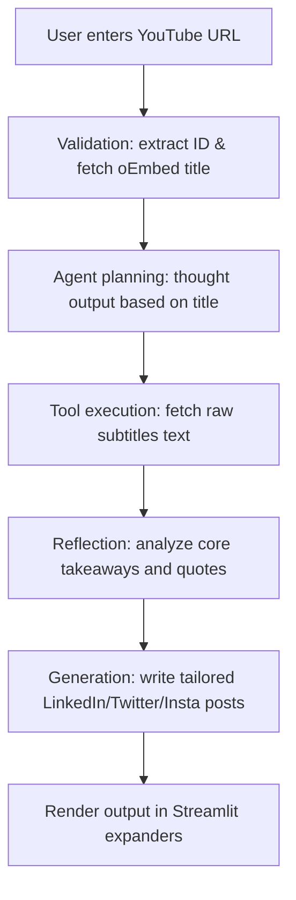

# AI Interview Cheat Sheet: YouTube Agentic AI Repurposer

This document is designed to help you explain, defend, and showcase this project during software engineering and AI agent developer interviews.

---

## 🧠 1. Core Concept: What is Agentic AI?

Traditional AI applications run on **static pipelines** (deterministic code chains). For example:
`User Input` ➡️ `Fetch Transcript` ➡️ `Summarize via LLM` ➡️ `Output`.

In contrast, **Agentic AI** introduces **autonomy, reasoning, and closed-loop control**:
- **Planning**: The AI analyzes the user's objective and generates its own thought-plan before acting.
- **Tool Usage**: The agent decides to run external API calls (the transcript fetcher) as tools to gather information.
- **Reflection**: The agent reads the raw tool outputs and reflects on them ("What is the core message? What are the key takeaways?") before generating final outputs.
- **Execution**: The agent adapts its content generation dynamically based on its reflection.

---

## ⚖️ 2. Comparison: Chatbot vs. AI Agent

| Feature | Simple Chatbot (Retrieval / Q&A) | AI Agent (This Project) |
| :--- | :--- | :--- |
| **Control Flow** | Sequential, hardcoded API paths. | Autonomous iteration (Planning ➡️ Action ➡️ Reflection). |
| **Tool Usage** | Direct prompt text translation only. | Programmatically invokes external utilities (transcript extractor). |
| **Reasoning** | Matches prompt inputs directly to outputs. | Explains its thoughts, critiques inputs, and refines insights. |
| **Output Quality** | High chance of robotic templates. | Guided by custom reflection to maintain human-like copy. |

---

## 🛠️ 3. Why LangChain?

We use LangChain for:
1. **Model Agnostic Interfaces**: `ChatGoogleGenerativeAI` exposes standard interfaces (`invoke`, `stream`) mapping to Google's API, making it easy to swap in OpenAI (`ChatOpenAI`) or Anthropic (`ChatAnthropic`) without changing the agent's logic.
2. **Unified Message Structure**: LangChain uses structured classes like `HumanMessage` and `SystemMessage` to manage conversational history consistently.
3. **Payload Management**: It handles serialization, retry configurations, and edge cases (like mapping system guidelines to human messages to support different endpoint schema rules).

---

## 🔄 4. How the Workflow Operates (Step-by-Step)

1. **Input Validation**: `utils.py` validates the URL, extracts the video ID, and fetches metadata.
2. **Thought (Planning)**: The agent invokes `PLANNING_PROMPT` to outline a strategy for the title.
3. **Action (Tool Use)**: The agent runs `fetch_transcript` to get the raw subtitles.
4. **Reasoning (Reflection)**: The agent reads the transcript and reflects using `REFLECTION_PROMPT`.
5. **Output Generation**: The agent feeds the reflection into target templates (`prompts.py`) to output summaries, LinkedIn posts, Twitter threads, and Instagram captions.

---

## 💬 5. Top 10 Technical Interview Questions & Answers

### Q1: "What makes this project 'Agentic' instead of just a standard LLM wrapper?"
**Answer:** "A typical wrapper passes user input directly to a prompt and displays the response. This project implements a reasoning loop. The agent is aware of its metadata, plans how it will approach the video, programmatically executes a transcript-fetching tool, reviews the tool's raw output, reflects on it to extract core points, and drafts custom posts. The UI displays this thought process live, which shows planning and self-reflection."

### Q2: "Why does the agent generate a plan and reflection instead of writing the posts directly from the transcript?"
**Answer:** "There are two reasons: context window boundaries and content quality. Transcripts can be thousands of words. Passing raw text directly to multiple generation tasks creates clutter. By having the agent reflect and condense the transcript into a high-value summary first, we save token costs, avoid output truncation, and ensure that the final posts are aligned with the speaker's true insights."

### Q3: "How does your transcript utility handle different API versions of `youtube-transcript-api`?"
**Answer:** "In newer versions (v1.2.4+), `YouTubeTranscriptApi.get_transcript` was removed in favor of instance methods (`api.fetch()` and `api.list()`). Additionally, returned segments changed from plain dictionaries to custom `@dataclass` objects. I implemented a version-agnostic lookup helper that instantiates the class and checks if segments are dictionaries or objects using `isinstance()` and `getattr()`. This prevents the application from crashing on library updates."

### Q4: "I notice you set `convert_system_message_to_human=True` and `api_version='v1'` for Gemini. Why?"
**Answer:** "Google's stable `v1` endpoint is the production API, but it does not support passing a `systemInstruction` field in the API payload. If you send a standard LangChain `SystemMessage`, the API throws a `400 BadRequest`. Setting `convert_system_message_to_human=True` tells LangChain to merge the system prompts directly into the message history, resolving the validation error while preserving the stable API version."

### Q5: "How would you scale this simple agent to handle videos without captions?"
**Answer:** "I would add an audio extraction tool to our agent's toolkit. If `youtube-transcript-api` fails due to subtitles being disabled, the agent would fall back to downloading the audio stream (using a tool like `yt-dlp`) and transcribing it using an Whisper ASR API before passing it to the reasoning loop."

### Q6: "How did you configure the LLM model name so it is maintainable?"
**Answer:** "I centralized it in a single variable, `MODEL_NAME = 'gemini-2.0-flash'`, in `agent.py`. It is imported by `app.py`. If we need to transition to a newer model (e.g. `gemini-2.5-flash`), we update it in that one place, preventing bugs throughout the codebase."

### Q7: "How does Streamlit display the agent's thought logs in real time?"
**Answer:** "The agent's `run()` method is written as a Python generator using `yield`. As the agent progresses through planning, tool execution, and reflection, it yields status updates. The Streamlit UI iterates over this generator within a modern `st.status` widget, rendering the agent's thoughts in real time."

### Q8: "How does your agent handle context limit overflows for very long videos?"
**Answer:** "In `agent.py`, the agent has a built-in safety margin. Before sending the raw transcript to the reflection step, it truncates the character string (e.g. `transcript_text[:35000]`). This keeps the input well within the token bounds of the model, preventing out-of-memory or timeout errors."

### Q9: "Why didn't you use LangChain's built-in React Agent Executor?"
**Answer:** "While LangChain's `initialize_agent` is powerful, it adds heavy abstractions and is prone to parser failures on smaller models. To keep the project clear, easy to explain, and bulletproof for interviews, I built a custom, lightweight agent loop using standard python generators. It achieves the exact same concepts (thought, tool use, reflection, execution) in about 50 lines of clean code."

### Q10: "If you had to deploy this to production, what would you add?"
**Answer:** "I would implement asynchronous task queues (like Celery/Redis) because AI generation takes time. I would also add user authentication, rate limiting to protect API keys, database integration (like PostgreSQL) to persist generation histories, and integrations with social media API endpoints (like LinkedIn API) to schedule posts automatically."
