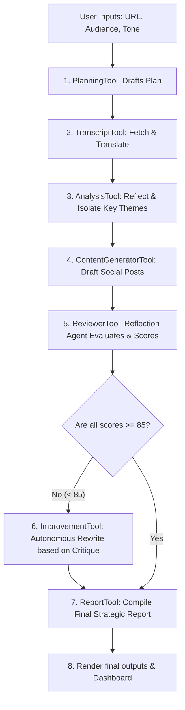

# AI Developer Interview Study Guide: Upgraded Youtube AI Agent

This document explains the advanced agentic features in this project. Use these talking points to demonstrate your expertise in AI agent architecture during software engineering and AI developer interviews.

---

## 🚀 1. Advanced Agentic Design Patterns Showcased

Rather than running a hardcoded prompt pipeline, this project demonstrates five core patterns of **Agentic AI**:

### 1. Planning & Goal Alignment
Before executing any generation tools, the agent calls `PlanningTool`. It evaluates the video title alongside your selected **Audience** and **Tone** to create a custom 3-step execution plan. It then reasons step-by-step through this plan.

### 2. Tool Orchestration
The project is structured as a collection of separate, modular tools:
* `PlanningTool`: Generates the plan.
* `TranscriptTool`: Downloads and translates transcripts.
* `AnalysisTool`: Extracts themes and quotes.
* `ContentGeneratorTool`: Writes the drafts.
* `ReviewerTool`: Self-evaluates the output.
* `ImprovementTool`: Refines the drafts.
* `ReportTool`: Writes the final strategic review.

The agent coordinates these tool calls programmatically, mimicking a real-world task-orchestrator.

### 3. Self-Reflection & Evaluation
After the initial generation of drafts, the agent passes them to the `ReviewerTool` (acting as a critic). The reviewer:
* Rates each post's quality from 0 to 100.
* Evaluates the hook, CTA, and hashtags against the target audience and tone.
* Explains the strategic reasoning behind why the copy fits or fails.

### 4. Iterative Self-Improvement (Feedback Loop)
If any generated asset scores below **85/100**, the agent intercepts the output, reads the reviewer's critiques, and calls the `ImprovementTool` to rewrite that specific post. This shows **autonomous self-correction**, a key indicator of true agentic behavior.

### 5. Session Memory
The application uses Streamlit's session state to store previous runs. The user can reload past runs, allowing comparisons between different audience and tone settings (e.g. comparing how the agent writes for "Recruiters" in a "Professional" tone vs. "Students" in a "Humorous" tone).

---

## 🔄 2. The Agentic Flow Diagram

---

## 💬 3. Top 10 Technical Interview Questions & Answers

### Q1: "What makes this an AI Agent rather than a standard LLM chain?"
**Answer:** "A standard LLM chain is a hardcoded pipeline that executes in a fixed order. This project is an agent because it possesses **autonomous control loops**. It plans its workflow, executes tools, evaluates its own outputs using critiques and scores, and autonomously decides whether it needs to run a self-correction loop to rewrite weak content. The decision-making is shifted from the code structure to the agent's reasoning."

### Q2: "How does the agent perform self-reflection and self-improvement?"
**Answer:** "I implemented a `ReviewerTool` that reads the first-draft posts and outputs a structured evaluation JSON containing critiques and scores from 0-100. The agent inspects these scores. If any score falls below an 85/100 threshold, it calls the `ImprovementTool` with the critique to rewrite the post. In the UI's 'Interview Mode', I display the 'before and after' diffs to visually demonstrate this self-correction loop."

### Q3: "How is the project designed for Explainability?"
**Answer:** "Interviewers and users appreciate transparency. In the reviewer step, the agent is forced to explain *why* the chosen hook, call-to-action, and hashtags fit the selected target audience and tone. This explanation is displayed directly underneath each post in the UI, proving the agent's decisions are aligned with the user's goals."

### Q4: "How does the agent handle different target audiences and tones?"
**Answer:** "The user can select from 6 audiences (e.g. Recruiters, Developers) and 6 tones (e.g. Professional, Humorous). The agent passes these as variables to both the planning and content generation tools. This forces the LLM to adjust its vocabulary, formatting, hook style, and CTA topics dynamically."

### Q5: "How did you design the Agent Dashboard and what metrics do you track?"
**Answer:** "I designed a real-time dashboard that displays execution metrics: total elapsed run time (using `time.time()`), transcript length (words), final output word count, the LLM model used, and a list of completed steps. This gives the application a professional, operational feel."

### Q6: "How did you implement Memory without adding database bloat?"
**Answer:** "I utilized Streamlit's `st.session_state` to store a history list of completed runs. When a run finishes, the metadata, inputs, and final results are saved to this state list. A dropdown in the sidebar allows the user to instantly reload and compare previous generations, demonstrating how the agent adapts the same video transcript for different audiences."

### Q7: "How does your transcript tool handle failures and foreign videos?"
**Answer:** "I built a robust, 2-pass transcript extraction utility in `utils.py`. If a direct English download fails, the utility lists available transcripts and searches for manually created or auto-generated English. If only a foreign language transcript is available (like Hindi or Spanish), it automatically translates it to English. If subtitles are completely disabled, it intercepts the exception and suggests alternative available languages rather than crashing."

### Q8: "Why did you use standard python generators (`yield`) for the agent execution?"
**Answer:** "By writing the agent's `run()` method as a python generator, the agent can yield its current status, thoughts, and logs during execution. Streamlit intercepts these yields and renders them live inside an `st.status` widget. This provides a visual trace of the agent's thought process in real-time."

### Q9: "Why is the model name centralized and how did you solve the Gemini 404/400 errors?"
**Answer:** "The model name is configured via a single variable, `MODEL_NAME = 'gemini-1.5-flash'`, in `agent.py`. I solved Google's `400 BadRequest` error by passing `convert_system_message_to_human=True` and `api_version='v1'` to `ChatGoogleGenerativeAI`, preventing payload structure issues. Furthermore, if a `404 NOT_FOUND` occurs due to key restrictions, my agent automatically runs a diagnostic using the `google-genai` SDK to fetch and print authorized model names on screen."

### Q10: "If you had to scale this agent, how would you approach it?"
**Answer:** "To scale, I would:
1. Move from synchronous execution to an asynchronous task queue (e.g. Celery and Redis) since LLM calls can take time.
2. Implement vector search (RAG) to allow the agent to pull context from a database of previous video transcripts.
3. Build direct OAuth integrations to allow the agent to post the approved drafts directly to LinkedIn and Twitter."
